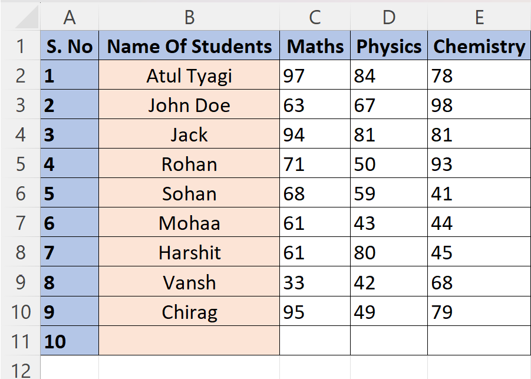
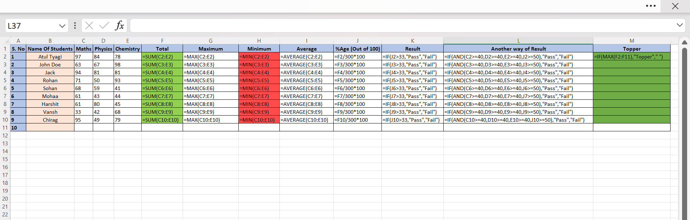
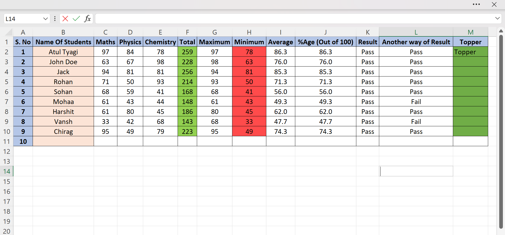

# Student Performance Analysis Using Excel

## Project Overview

This project demonstrates how Microsoft Excel can be used to analyze student academic performance efficiently. The workbook contains student marks in multiple subjects and uses Excel formulas to automate calculations such as total marks, average marks, grades, rankings, result status, and topper identification.

The project showcases the practical application of spreadsheet functions for educational data analysis and reporting.

---

## Objectives

* Organize student academic records in a structured format.
* Calculate total and average marks automatically.
* Assign grades based on student performance.
* Generate student rankings.
* Determine pass/fail status using logical conditions.
* Identify the topper of the class.
* Demonstrate the use of Excel formulas for data analysis.

---

## Dataset Information

The dataset contains the following fields:

* Student Name
* Mathematics Marks
* Science Marks
* English Marks
* Total Marks
* Average Marks
* Grade
* Rank
* Result Status
* Topper Identification

---

## Questions Solved

1. How can student marks be organized in Microsoft Excel?
2. How can total marks be calculated automatically?
3. How can average marks be calculated using Excel formulas?
4. How can grades be assigned based on performance?
5. How can student rankings be generated automatically?
6. How can pass/fail status be determined using logical formulas?
7. How can the class topper be identified?
8. How can multiple methods be used to validate student results?

---

## Features

* Automatic Total Marks Calculation
* Automatic Average Marks Calculation
* Grade Assignment
* Student Ranking System
* Pass/Fail Evaluation
* Topper Identification
* Formula-Based Analysis
* Structured Student Report

---

## Technologies Used

* Microsoft Excel
* Excel Formulas
* Logical Functions
* Ranking Functions
* Spreadsheet-Based Data Analysis

---

## How to Use

1. Download the Excel workbook.
2. Open the file in Microsoft Excel.
3. Explore the dataset and formulas.
4. Modify marks if required.
5. Observe automatic updates in:

   * Total Marks
   * Average Marks
   * Grades
   * Rankings
   * Results
   * Topper Status

---

## Learning Outcomes

Through this project, the following concepts are demonstrated:

* Spreadsheet Data Management
* Formula-Based Calculations
* Educational Data Analysis
* Performance Evaluation
* Ranking and Grading Systems
* Logical Decision-Making Using Excel

---

## Future Improvements

* Add charts and dashboards.
* Create interactive reports.
* Include attendance analysis.
* Build subject-wise performance summaries.
* Integrate advanced Excel features such as Pivot Tables and Conditional Formatting.

---

## Author

Atul Tyagi

Mini Project – Student Performance Analysis Using Microsoft Excel

## Project Screenshots

### 1. Student Dataset

This sheet contains student records and subject-wise marks used for analysis.

---

### 2. Formula Implementation

This view demonstrates the Excel formulas used to calculate total marks, average marks, grades, rankings, and result status.

---

### 3. Final Output and Analysis

This output displays the calculated results, grades, rankings, pass/fail status, and topper identification.

